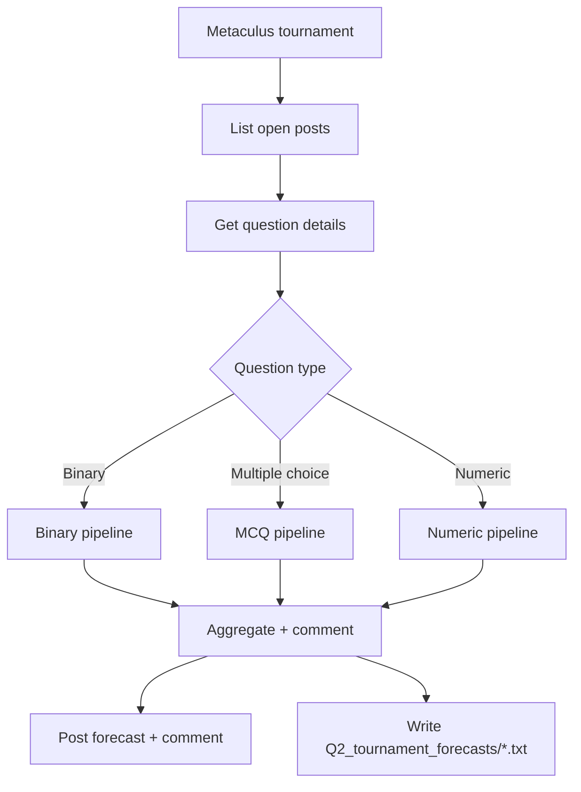

# Forecasting Bot Detailed System Recommendation

This document is a deeper, implementation-level walkthrough of how the forecasting bot works. It is intentionally more detailed than `README.md`, and it includes concrete examples, API inventory, and mermaid diagrams that reflect the current codebase.

## Audience and scope

- Audience: anyone operating, extending, or auditing the bot.
- Scope: `Bot/` pipeline used by `Bot/main.py`, plus benchmarking in `Bot/benchmark.py` and legacy/experimental entry points.

Example usage goal:

```bash
python Bot/main.py
```

## Repo map and entry points

Key directories:

- `Bot/`: core forecasting pipeline.
- `Q2_tournament_forecasts/`: per-question run outputs from `Bot/main.py`.
- `new_benchmark/`: benchmark run outputs created by `Bot/benchmark.py`.
- `new_benchmark_o1/`: historical artifacts (not written by current code).

Entry points:

- `Bot/main.py`: primary production run for tournament forecasting.
- `Bot/benchmark.py`: evaluation and plotting.
- `Bot/metaculus_bot.py`: older pipeline, still functional but not the default.
- `Bot/forecaster_template.py`: simplified baseline implementation.
- `Bot/try.py`: experimental agentic search demo.

Example: run the main pipeline on tournament questions

```bash
python Bot/main.py
```

Example: run the benchmark

```bash
python Bot/benchmark.py
```

## End-to-end pipeline (main run)

High-level flow of `Bot/main.py`:

1. Pull open Metaculus posts for a tournament (or use example questions).
2. For each question, fetch details.
3. Skip if already forecasted (optional).
4. Route to type-specific forecasting pipeline: binary, multiple choice, or numeric.
5. Aggregate outputs and optionally post predictions and comments back to Metaculus.
6. Persist a per-question summary file in `Q2_tournament_forecasts/`.

Mermaid overview:



Example: output file naming

If the question title is `Will the S&P 500 index go up in May 2025?`, the output file is:

```
Q2_tournament_forecasts/Will_the_S_P_500_index_go_up_in_May_2025_.txt
```

## Agent committee and LLM calls

The main pipeline uses a 5-forecaster committee for each question:

- 2x Claude via Metaculus Anthropic proxy (`call_claude`)
- 1x GPT o4-mini via Metaculus OpenAI proxy (`call_gpt_o4_mini`)
- 2x GPT o3 via direct OpenAI API (`call_gpt_o3`)

Weighted aggregation is applied:

- Binary and multiple choice: weights `[1, 1, 1, 2, 2]` (o3 outputs are double-weighted).
- Numeric: CDFs are weighted the same (o3 outputs have weight 2).

Important implementation note:

- `call_gpt_o3` currently returns early to the direct OpenAI call and does not use the Metaculus proxy code path below it. This means `OPENAI_API_KEY` is required for o3 in the main pipeline even if `METACULUS_TOKEN` is set.

Mermaid: how the committee is used

```mermaid
flowchart LR
  Q[Question details] --> H[Historical search queries (o3)]
  Q --> C[Current search queries (o3)]
  H --> S[process_search_queries]
  C --> S
  S --> CTX[Context bundle]

  CTX --> OV[Outside view prompt]
  OV --> C1[Claude 1]
  OV --> C2[Claude 2]
  OV --> O4[o4-mini]
  OV --> O3a[o3 #1]
  OV --> O3b[o3 #2]

  C1 --> IV[Inside view prompt]
  C2 --> IV
  O4 --> IV
  O3a --> IV
  O3b --> IV

  IV --> AGG[Weighted aggregator]
  AGG --> OUT[Forecast + comment]
```

Example: binary aggregation

Assume forecaster outputs are 32, 40, 35, 28, 30 (%).

Weighted average = (32 + 40 + 35 + 2*28 + 2*30) / 7 = 32.6%

## Search and retrieval pipeline

Search is driven by LLM-generated queries and multi-source retrieval:

1. LLM generates search queries for historical context and current context.
2. `process_search_queries` parses queries and dispatches them:
   - Google / Google News via Serper API.
   - AskNews API for curated news summaries.
   - Agentic search (iterative Google + raw article extraction).
   - Perplexity is supported but mapped to Agent in the current search parser.
3. URLs are scraped via Bright Data; fallback is Playwright (patchright).
4. Extracted content is summarized by an LLM using the question context.

Mermaid: retrieval detail

```mermaid
flowchart TD
  Q[Question details] --> L[LLM query generation]
  L --> P[process_search_queries]
  P --> G[Serper Google/News]
  P --> A[AskNews]
  P --> R[Agentic search]
  G --> X[FastContentExtractor]
  X --> E[HTMLContentExtractor]
  E --> S[Summarizer (o3)]
  A --> C[Context bundle]
  R --> C
  S --> C
```

Example: a query block produced by an LLM

```text
Search queries:
1. US unemployment rate May 2025 (Google)
2. BLS unemployment May 2025 release (Google News)
3. latest labor market trends and forecasts (Assistant)
```

Example: how those queries are interpreted

- Google -> Serper search -> URL list -> Bright Data scrape -> summarize.
- Google News -> Serper news endpoint -> URL list -> Bright Data scrape -> summarize.
- Assistant -> AskNews API -> short news summaries (no scraping).

## Content extraction details

`FastContentExtractor` uses:

- Bright Data request API to fetch raw HTML.
- `HTMLContentExtractor` to extract readable text via:
  - site-specific selectors,
  - Trafilatura,
  - Readability,
  - Boilerpy3.
- Optional fallback to Playwright (`browser.py`) when HTML is too short.

Example: fallback scenario

```text
Bright Data returns short HTML (< 1400 chars)
-> fetch_full_html() with Playwright
-> HTMLContentExtractor selects best content source
```

## Forecasting by question type

### Binary questions (`Bot/binary.py`)

Steps:

1. Generate historical and current search queries (o3).
2. Retrieve and summarize sources (Google/News/AskNews/Agentic).
3. Outside view prompt -> 5 forecasters.
4. Inside view prompt -> 5 forecasters.
5. Parse "Probability: ZZ%" from each inside-view output.
6. Weighted average -> final probability in [0.001, 0.999].

Detailed pipeline and agent roles:

1. Search planner (o3) produces two query sets: historical and current.
2. Retrieval agent (`process_search_queries`) executes those queries via Serper, AskNews, or Agentic search.
3. Summarizer agent (o3) compresses scraped articles into short evidence blocks.
4. Outside-view committee produces a base-rate forecast from historical context.
5. Inside-view committee refines the base rate using current context plus each member's outside-view output.
6. Parser + aggregator extracts `Probability: ZZ%` and applies weights.

Mermaid: binary pipeline (search -> research -> forecast)

```mermaid
flowchart TD
  Q[Question details] --> HS[Search planner (o3) - historical]
  Q --> CS[Search planner (o3) - current]
  HS --> HR[process_search_queries]
  CS --> CR[process_search_queries]
  HR --> HC[Historical context]
  CR --> CC[Current context]
  HC --> OV[Outside view prompt]
  OV --> C1[Claude 1]
  OV --> C2[Claude 2]
  OV --> O4[o4-mini]
  OV --> O3a[o3 #1]
  OV --> O3b[o3 #2]
  C1 --> IV[Inside view prompts]
  C2 --> IV
  O4 --> IV
  O3a --> IV
  O3b --> IV
  CC --> IV
  IV --> P[Parse Probability: ZZ%]
  P --> A[Weighted average]
  A --> OUT[Final binary probability]
```

Example: required output format for parsing

```text
Probability: 42%
```

Example: simplified inside-view output snippet

```text
Analysis:
... reasoning ...
Probability calibration:
... calibration ...
Checklist:
... brief checklist ...
Probability: 42%
```

### Multiple choice questions (`Bot/multiple_choice.py`)

Steps:

1. Generate historical and current search queries (o3).
2. Retrieve and summarize sources.
3. Outside view prompt -> 5 forecasters.
4. Inside view prompt -> 5 forecasters.
5. Parse `Probabilities: [p1, p2, ...]` list.
6. Normalize each forecaster list.
7. Weighted average -> final distribution by option.

Detailed pipeline and agent roles:

1. Search planner (o3) emits historical/current query sets tuned to the answer options.
2. Retrieval agent gathers sources and produces a shared context bundle.
3. Outside-view committee estimates option probabilities from historical context.
4. Inside-view committee adjusts those priors using current context and their own priors.
5. Parser extracts each forecaster's `Probabilities: [...]` list.
6. Normalizer rescales each list to sum to 1.
7. Aggregator applies weights and maps probabilities to option labels.

Mermaid: multiple choice pipeline (search -> research -> distribution)

```mermaid
flowchart TD
  Q[Question details + options] --> HS[Search planner (o3) - historical]
  Q --> CS[Search planner (o3) - current]
  HS --> HR[process_search_queries]
  CS --> CR[process_search_queries]
  HR --> HC[Historical context]
  CR --> CC[Current context]
  HC --> OV[Outside view prompt]
  OV --> C1[Claude 1]
  OV --> C2[Claude 2]
  OV --> O4[o4-mini]
  OV --> O3a[o3 #1]
  OV --> O3b[o3 #2]
  C1 --> IV[Inside view prompts]
  C2 --> IV
  O4 --> IV
  O3a --> IV
  O3b --> IV
  CC --> IV
  IV --> P[Parse Probabilities list]
  P --> N[Normalize per forecaster]
  N --> A[Weighted average]
  A --> OUT[Final option distribution]
```

Example: required output format for parsing

```text
Probabilities: [12, 20, 18, 30, 20]
```

Example: resulting payload format

```json
{
  "Option A": 0.12,
  "Option B": 0.20,
  "Option C": 0.18,
  "Option D": 0.30,
  "Option E": 0.20
}
```

### Numeric questions (`Bot/numeric.py`)

Steps:

1. Generate historical and current search queries (o3).
2. Retrieve and summarize sources.
3. Outside view prompt -> 5 forecasters.
4. Inside view prompt -> 5 forecasters.
5. Parse percentiles from the `Distribution:` block.
6. Enforce strictly increasing values.
7. Generate a 201-point CDF with PCHIP interpolation (SciPy).
8. Apply Metaculus CDF constraints:
   - Open bounds must be at least 0.001 and at most 0.999.
   - CDF step size must not exceed 0.59.
9. Weighted average CDF -> final distribution.

Detailed pipeline and agent roles:

1. Search planner (o3) writes historical/current queries with numeric units in mind.
2. Retrieval agent produces a context bundle of relevant data series and sources.
3. Outside-view committee estimates a coarse percentile sketch.
4. Inside-view committee outputs a `Distribution:` block (percentiles).
5. Parser extracts percentiles, enforces monotonicity, and builds a per-forecaster CDF.
6. Constraint enforcer fixes open-bound and step-size requirements.
7. Aggregator averages CDFs using weights.

Mermaid: numeric pipeline (search -> research -> CDF)

```mermaid
flowchart TD
  Q[Question details + bounds] --> HS[Search planner (o3) - historical]
  Q --> CS[Search planner (o3) - current]
  HS --> HR[process_search_queries]
  CS --> CR[process_search_queries]
  HR --> HC[Historical context]
  CR --> CC[Current context]
  HC --> OV[Outside view prompt]
  OV --> C1[Claude 1]
  OV --> C2[Claude 2]
  OV --> O4[o4-mini]
  OV --> O3a[o3 #1]
  OV --> O3b[o3 #2]
  C1 --> IV[Inside view prompts]
  C2 --> IV
  O4 --> IV
  O3a --> IV
  O3b --> IV
  CC --> IV
  IV --> P[Parse Distribution percentiles]
  P --> M[Monotonic fix + CDF build]
  M --> E[Enforce CDF constraints]
  E --> A[Weighted average]
  A --> OUT[Final 201-point CDF]
```

Example: required output format for parsing

```text
Distribution:
Percentile 1: 10
Percentile 5: 12
Percentile 10: 14
Percentile 20: 16
Percentile 40: 20
Percentile 60: 25
Percentile 80: 30
Percentile 90: 36
Percentile 95: 40
Percentile 99: 50
```

Example: output payload type (truncated CDF)

```text
[0.001, 0.003, 0.007, 0.012, ... 0.998, 0.999]
```

## Posting to Metaculus

`Bot/main.py` posts forecasts and comments using the Metaculus API:

- POST `https://www.metaculus.com/api/questions/forecast/`
- POST `https://www.metaculus.com/api/comments/create/`

The comment posted is marked as `is_private: true` and `included_forecast: true`.

Example: binary forecast payload

```json
[
  {
    "question": 12345,
    "probability_yes": 0.42,
    "probability_yes_per_category": null,
    "continuous_cdf": null
  }
]
```

Example: comment summarization behavior

`Bot/main.py` builds a long reasoning comment and then uses `search.call_gpt()` (o3) to compress it into a 5-7 sentence summary for posting.

## Benchmarking and evaluation

`Bot/benchmark.py` evaluates the bot against Metaculus community forecasts.

Key behaviors:

- By default, `USE_CUSTOM_QUESTIONS = True` and `get_custom_questions()` returns `ds[0]`, so the benchmark may only run on a single item unless you modify it.
- For open Metaculus questions, `get_open_binary_questions()` pulls via the Metaculus `api2` endpoint.
- Scores use `normalized_eval()`, which simulates a mixture of "good" and "bad" peers using Beta (binary) or Dirichlet (MCQ) distributions, then computes the expected peer score.

Example: normalized_eval for binary

```text
Inputs: bot=0.42, community=0.38
Simulate 1000 peer populations
Compute mean expected peer score
Return average score
```

Example: running the benchmark

```bash
python Bot/benchmark.py
```

Example: benchmark output artifact

```
new_benchmark/Will_the_price_of_one_bitcoin_on_July_1_2025_be_more_than_USD__120_000_.txt
```

## Output artifacts

`Bot/main.py` writes one file per question:

- Location: `Q2_tournament_forecasts/`
- Name: sanitized question title with non-alphanumeric chars replaced by `_`.

Example output snippet:

```text
-----------------------------------------------
Question: Will X happen before Y?
URL: https://www.metaculus.com/questions/12345/
Forecast: 0.42
Comment:
```

## Configuration and environment variables

Minimum required for the main pipeline:

- `METACULUS_TOKEN` (for Metaculus API and Anthropic proxy)
- `OPENAI_API_KEY` (for o3 via direct OpenAI)
- `SERPER_KEY` (for Google/Google News search)
- `ASKNEWS_CLIENT_ID` and `ASKNEWS_SECRET` (for AskNews assistant summaries)
- `BRIGHT_DATA_API_KEY` (for web scraping)

Optional (used in legacy or alternative flows):

- `PERPLEXITY_API_KEY` (Perplexity deep research; legacy/agent)
- `EXA_API_KEY` (Exa / forecasting_tools in `metaculus_bot.py`)

Example `.env` fragment:

```text
METACULUS_TOKEN=your_metaculus_token
OPENAI_API_KEY=your_openai_key
SERPER_KEY=your_serper_key
ASKNEWS_CLIENT_ID=your_asknews_id
ASKNEWS_SECRET=your_asknews_secret
BRIGHT_DATA_API_KEY=your_bright_data_key
```

## API inventory (where and why)

| API | Purpose | Primary code paths | Env var |
| --- | --- | --- | --- |
| Metaculus API | List posts, fetch question details, post forecasts/comments | `Bot/main.py`, `Bot/benchmark.py`, `Bot/metaculus_bot.py` | `METACULUS_TOKEN` |
| Metaculus LLM proxy (Anthropic) | Claude forecasters | `Bot/llm_calls.py` | `METACULUS_TOKEN` |
| Metaculus LLM proxy (OpenAI) | o4-mini forecaster | `Bot/llm_calls.py` | `METACULUS_TOKEN` |
| OpenAI API (direct) | o3 forecasters, summarizer, agentic query planning | `Bot/llm_calls.py`, `Bot/search.py`, `Bot/try.py` | `OPENAI_API_KEY` |
| Serper (Google/News) | Search URLs for scraping | `Bot/search.py` | `SERPER_KEY` |
| AskNews | News summaries for current context | `Bot/search.py`, `Bot/metaculus_bot.py`, `Bot/forecaster_template.py` | `ASKNEWS_CLIENT_ID`, `ASKNEWS_SECRET` |
| Perplexity | Deep research (legacy/optional) | `Bot/search.py`, `Bot/metaculus_bot.py`, `Bot/forecaster_template.py` | `PERPLEXITY_API_KEY` |
| Bright Data | Fetch raw HTML for scraping | `Bot/FastContentExtractor.py` | `BRIGHT_DATA_API_KEY` |
| Playwright (patchright) | JS-rendered HTML fallback | `Bot/browser.py` | none |
| Exa / forecasting_tools | Smart searcher (legacy) | `Bot/metaculus_bot.py` | `EXA_API_KEY` |

Example: why multiple APIs are used

- Serper is used to get URLs quickly (low latency).
- Bright Data and Playwright are used to extract full article text reliably, even when pages are JS-heavy or paywalled.
- AskNews provides structured short summaries that can be used without scraping.
- o3 and Claude are used together to reduce single-model bias in the ensemble.

## Legacy and experimental flows

- `Bot/metaculus_bot.py` is a self-contained older pipeline with a single prompt style per type and a simplified research workflow.
- `Bot/forecaster_template.py` is a minimal baseline with fewer steps.
- `Bot/try.py` demonstrates agentic search and OpenAI `web_search_preview` tool usage.

Example: running the template forecaster for debugging

```python
# Inside a Python REPL
import asyncio
from Bot.forecaster_template import binary_forecast
details = {"title": "Test?", "resolution_criteria": "", "description": "", "fine_print": ""}
asyncio.run(binary_forecast(details))
```

## Operational recommendations

- Make sure `OPENAI_API_KEY` is set; the main pipeline uses direct OpenAI calls for o3.
- If `BRIGHT_DATA_API_KEY` is missing, search will still run but content extraction will fail or be low quality.
- `NUM_RUNS_PER_QUESTION` in `Bot/main.py` does not currently control the committee size; each type-specific module uses a fixed five-forecaster ensemble.
- When debugging parsing issues, check for strict output formats required by regex in `binary.py`, `multiple_choice.py`, and `numeric.py`.

Example: quick sanity check for output formats

```text
Binary: "Probability: 37%"
MCQ:    "Probabilities: [10, 20, 30, 40]"
Numeric: block starting with "Distribution:"
```
