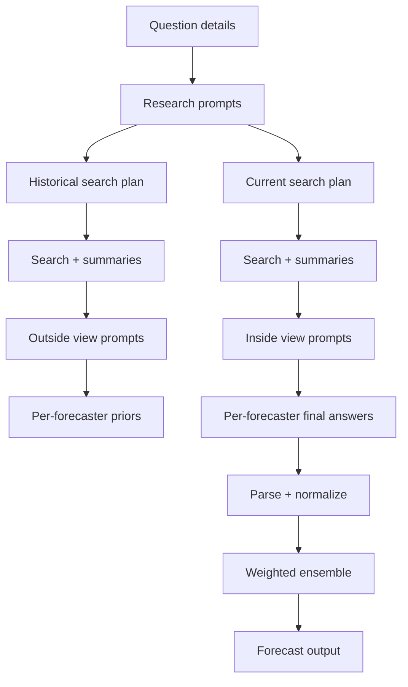
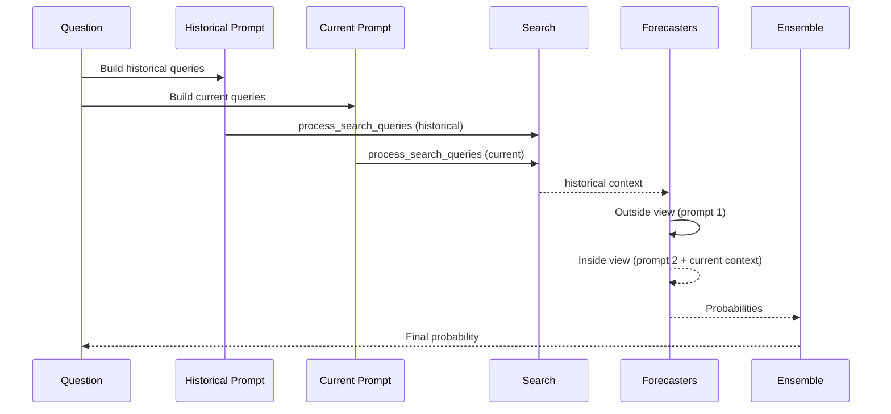
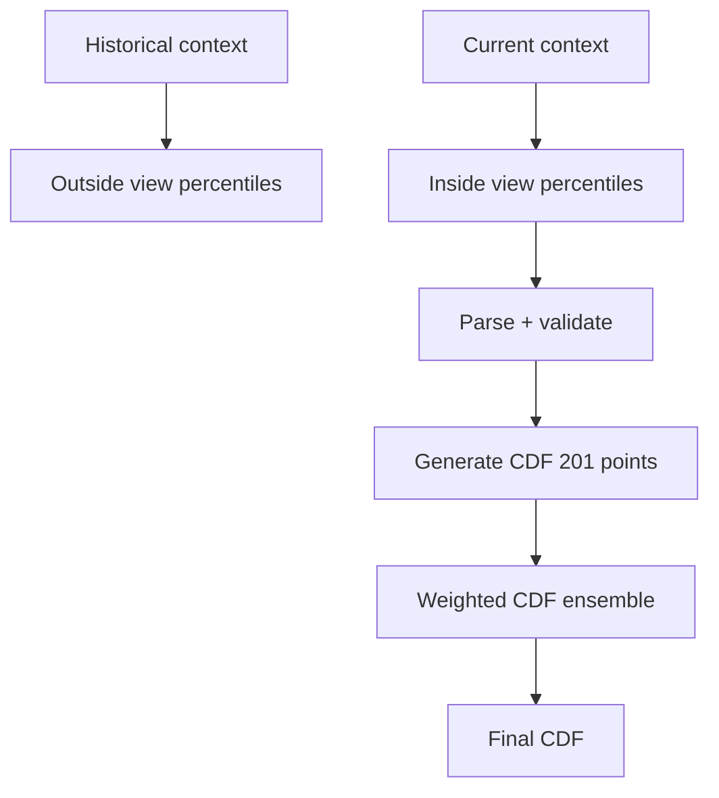
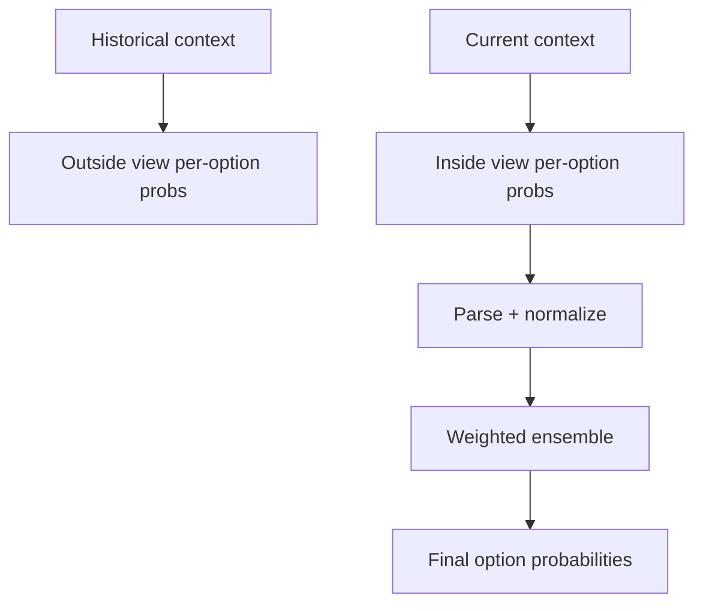

# Forecasting Agent Architecture

This document explains how the forecasting agent works, why each step exists, and how to extend it. It focuses on the multi-stage reasoning and research pipeline that produces probabilities.

## Executive summary
- The agent turns a question into a structured prompt, gathers historical and current evidence, runs a two-stage forecasting sequence (outside view then inside view), and ensembles five independent model forecasts.
- Research is split into "historical context" and "current context" to anchor base rates and then update with recent evidence.
- The final probability is a weighted blend of five forecaster models; numeric questions aggregate weighted CDFs.

## System map

## Entry points
1. `Bot/main.py` handles Metaculus tournament runs (fetch questions, run forecasts, post results).
2. `Bot/custom_forecast.py` handles interactive custom questions and benchmark runs.
3. `Bot/forecaster.py` routes to type-specific pipelines.

## Core pipeline steps (all question types)
The overall structure is similar across binary, numeric, and multiple-choice questions. Differences are in parsing and aggregation.

### 1) Input and structuring
`custom_forecast.py` builds a question dictionary with standardized fields: title, description, resolution criteria, fine print, type, and type-specific fields (e.g., bounds for numeric).

Why it matters:
- Ensures the LLM prompts always receive the same schema.
- Avoids prompt drift and resolution-criteria mismatch.

### 2) Research planning (historical and current)
Files: `Bot/binary.py`, `Bot/numeric.py`, `Bot/multiple_choice.py`

Each pipeline asks the LLM to produce search queries for:
- Historical context (outside view base rate)
- Current context (inside view update)

Search planning is explicit and constrained by prompt templates in `Bot/prompts.py`.

Why it matters:
- Separates base rate (slow-moving priors) from recent evidence (updates).
- Prevents recency bias from dominating the base rate.

### 3) Research execution
File: `Bot/search.py`

Search queries are parsed and routed to:
- Google/Google News via Serper + Bright Data scrapes (if enabled)
- AskNews summaries (if enabled)
- Perplexity Deep Research via OpenRouter
- Agentic search (LLM iteratively selects follow-up queries)

Why it matters:
- Increases coverage across sources and formats.
- Creates structured summaries that the forecasters can consume.

### 4) Outside-view reasoning (step 1)
Files: `Bot/binary.py`, `Bot/numeric.py`, `Bot/multiple_choice.py`

Each pipeline runs five forecasters against the historical context:
- Forecasters are different models defined in `Bot/model_config.py`.
- Prompts require reference class selection and base rate calibration.

Why it matters:
- Anchors the prediction on historical baselines.
- Model diversity reduces single-model bias.

### 5) Inside-view reasoning (step 2)
Files: `Bot/binary.py`, `Bot/numeric.py`, `Bot/multiple_choice.py`

Each forecaster receives:
- The current context summary
- Its own outside-view output

The model then updates probabilities based on recent evidence.

Why it matters:
- Forces a structured base-rate update rather than freeform final answers.
- Encourages calibration checks and explicit reasoning.

### 6) Parsing and normalization
Binary:
- Regex parses `Probability: ZZ%` (`Bot/binary.py`).
- Clamps and normalizes to `[0.001, 0.999]`.

Multiple choice:
- Regex parses `Probabilities: [..]`.
- Normalizes to a sum of 1.

Numeric:
- Parses percentiles from `Distribution:` section.
- Enforces monotonicity, bounds, and minimum step size in CDF.

Why it matters:
- Enforces strict machine-readable outputs.
- Prevents invalid distributions (especially for numeric CDFs).

### 7) Ensemble aggregation
Binary:
- Weighted average of forecasters (higher weight for two models).

Multiple choice:
- Weighted average of per-option probabilities.

Numeric:
- Weighted average of CDFs (higher weight for two models).

Why it matters:
- Aggregation reduces variance.
- Weighting allows favoring more reliable models.

## Binary pipeline deep dive
Key file: `Bot/binary.py`

Rationale for better probability estimates:
- Base-rate anchoring reduces overreaction to recent news.
- Two-stage prompts enforce a deliberate update step.
- Ensemble smooths model-specific noise.

## Numeric pipeline deep dive
Key file: `Bot/numeric.py`

Rationale:
- Percentile-based outputs are more robust than single-point estimates.
- CDF validation enforces monotonicity and Metaculus bounds.
- Weighted CDFs improve stability across models.

## Multiple-choice pipeline deep dive
Key file: `Bot/multiple_choice.py`

Rationale:
- Explicit per-option probabilities avoid winner-take-all bias.
- Normalization enforces a coherent probability distribution.

## Research subsystem notes
The research layer is configurable via `Bot/research_config.py`:
- `ENABLE_*` flags toggle AskNews, Serper/Google, Bright Data scraping, and Perplexity.
- Perplexity budget is split between historical and current contexts.

The main research executor is `Bot/search.py`, which:
- Parses "Search queries:" blocks from prompt outputs.
- Executes queries in parallel.
- Returns structured summaries with `Summary`, `Asknews_articles`, or `Agent_report` tags.

## LLM routing
Models are defined in `Bot/model_config.py` and invoked in `Bot/llm_calls.py`.
The default set is intentionally diverse across providers to reduce correlated errors.

## How to extend or improve the methodology

### A) Debate and adversarial calibration
Add a "challenge round" where a separate model critiques each forecaster’s analysis.
- Inputs: each forecaster's output and evidence list.
- Output: critique + suggested probability adjustment.
- Merge by penalizing probabilities with weak evidence or overconfidence.

Implementation idea:
- Add a new prompt in `Bot/prompts.py` (e.g., `CRITIQUE_PROMPT`).
- Add a pass after `results_prompt2` to collect critiques.

### B) Explicit base-rate libraries
Maintain a library of reference classes and historical frequencies for common question types.
- This can replace ad-hoc reference class selection when a match is available.
- Helps make base rates more consistent and reproducible.

Implementation idea:
- Add `base_rates/` with JSON or CSV.
- In `binary.py`, detect category and inject a base-rate snippet into prompt 1.

### C) Market-derived priors
Use prediction markets when available (e.g., Polymarket, Metaculus community)
to inform outside-view priors, then adjust with private evidence.

Implementation idea:
- Extend `search.py` to detect and parse market odds pages.
- Add a "market prior" block in the outside-view prompt.

### D) Fermi scaffolding
Force LLMs to output simplified Fermi estimates before final answers.
This reduces hallucinated precision and anchors on rough-order reasoning.

Implementation idea:
- Add a structured section in `BINARY_PROMPT_1` and `NUMERIC_PROMPT_1`.
- Parse and store Fermi assumptions for auditability.

### E) System 1 / System 2 split
Run a fast intuitive pass (System 1) and a slow analytic pass (System 2),
then reconcile differences.

Implementation idea:
- Introduce two prompts for each stage, with explicit fast/slow framing.
- Blend results or use System 2 to veto outliers from System 1.

### F) Coherence and calibration checks
Add automated checks for:
- Base-rate drift too far from prior without strong evidence.
- Inconsistencies across forecasters.
- Overconfident forecasts near 0 or 1.

Implementation idea:
- Add a post-processing validator in `binary.py` and `multiple_choice.py`.
- Emit warnings and optionally request a re-forecast.

### G) Evidence tracking and citations
Store structured citations and quote snippets for each forecast.
- Increases explainability and enables later audit.

Implementation idea:
- Extend `search.py` to return URL + title + date as structured JSON.
- Include citations in final `comment` outputs.

### H) Dynamic weighting by historical accuracy
Weight forecasters based on past performance by question type.
- Keeps ensemble adaptive and data-driven.

Implementation idea:
- Write a `forecaster_scores.json`.
- Adjust `weights` in `binary.py`, `numeric.py`, and `multiple_choice.py` dynamically.

### I) Alternative aggregation
Instead of weighted average, consider:
- Trimmed mean to reduce outlier influence.
- Median ensemble for robustness.
- Bayesian model averaging with uncertainty.

### J) Meta-forecasting and scenario synthesis
Create a small "meta-model" that reviews all outputs and produces a
final probability with explicit scenario weights.

Implementation idea:
- Add a final LLM pass that sees all five outputs and emits a weighted blend.
- Use it as an advisory input, not the sole decision-maker.

## Suggested documentation updates
- Add a pointer to this file in `README.md`.
- Add per-run output examples to illustrate each pipeline.
