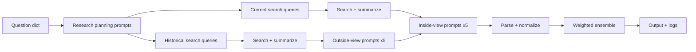
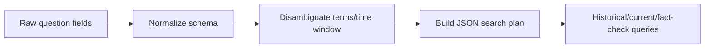
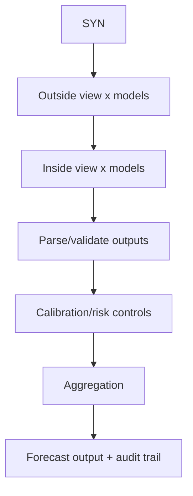
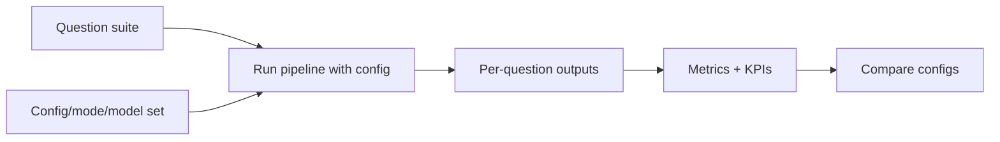

Forecasting Bot Implementation Plan

Goal
Build a step-by-step, testable roadmap to implement the methodology improvements
from "Improving the Forecasting Bot: Methodology Review and Advanced Strategies."
This plan is self-contained so a SWE unfamiliar with the project can follow it,
define any missing benchmarks, and ship changes safely.

Progress tracking
- Work log is maintained in `docs/DEV_DIARY.md`.
- Sections tagged `[DONE]` or notes inline reflect completed work to date.
- Keep updating both the plan and the diary as phases complete.
- Each assistant handoff should be summarized in the diary (include next steps) to preserve continuity.

Flexibility and sequencing
- This plan is intentionally modular. Treat phases as a menu with dependencies,
  not a strict linear checklist.
- Recommended starting point is Phase 0 (baseline + guardrails), but it is
  normal to reorder work when needed. Example: while doing Phase 0 you may
  realize you need API keys and provider diagnostics first (Phase 1), or you
  may need offline replay tests (Phase 2) before safely refactoring search
  (Phase 4).
- Rule of thumb: before changing behavior, ensure there is at least one fast
  way to detect breakages (offline tests + smoke suite), and a way to compare
  to baseline (replay backtesting).

 Success criteria
 - Each improvement is optional and configurable.
 - Each improvement has a measurable test or validation step.
 - Baseline performance is preserved or improved on defined benchmarks.
 - No data leakage (benchmarks use only information available before resolution).
 - Outputs remain machine-readable and UI-compatible.

Scope
- Codebase in this repo, especially `Bot/`.
- The existing forecasting pipeline for binary, numeric, and MCQ questions.
- Integrations and API keys used by the current system.

Non-goals (unless explicitly added later)
- Training or fine-tuning new LLMs.
- Building a new UI (use existing `ui/` viewer).
- Large-scale, indiscriminate web crawling ("download the internet").
- A bounded evidence cache ("evidence lake") IS in scope, but it must be:
  - query-scoped (only store what we retrieved)
  - reproducible (record exactly what was used)
  - cost-aware (cache to avoid repeated calls)
  - compliant (respect licenses/ToS; store minimal necessary content)

Inputs
- Report: `Improving the Forecasting Bot_ Methodology Review and Advanced Strategies.docx`
- Architecture docs: `docs/FORECASTING_AGENT.md`
- Project overview: `README.md`
- File map: `CODE_INDEX.md`

-------------------------------------------------------------------------------

Glossary (quick definitions for new engineers)

- Outside view: Start from historical base rates / reference class expectations.
- Inside view: Update the outside view with recent, question-specific evidence.
- Evidence: Any retrieved information used to justify a forecast (sources, dates).
- Ensemble: Combining multiple forecasts to reduce variance and correlated errors.
- Brier score (binary): Mean of (p - outcome)^2. Lower is better.
- Log score (binary): -log(p) for outcome=1 or -log(1-p) for outcome=0. Lower is better; heavily penalizes overconfidence.
- Data leakage: Using information that was not available at forecast time (e.g., articles published after the question resolved).
- Evidence lake: A persistent store of retrieved sources + extracted text + metadata, so runs can be replayed and audited.

-------------------------------------------------------------------------------

System overview (current, simplified)

This diagram is a conceptual view of the current implementation described in
`docs/FORECASTING_AGENT.md`.



Target modular architecture (proposed)

The goal is to separate concerns so each module can be improved, tested, and
benchmarked independently.

```mermaid
flowchart TD
  Q[Question dict] --> QS[Question structuring + disambiguation]
  QS --> PLAN[Search plan builder]
  PLAN --> RET[Retrieval providers]
  RET --> LAKE[Evidence lake (cache + index)]
  LAKE --> SYN[Evidence synthesis (rank/dedup/facts)]
  SYN --> FC[Forecasters (outside/inside)]
  FC --> AGG[Aggregation + calibration]
  AGG --> VAL[Validators (schema/coherence)]
  VAL --> OUT[Outputs (md/json) + metrics]
  OUT --> EXP[Experiment harness (A/B, sweeps)]
  EXP --> OUT
```

Engineering standards (applies to every phase)

- Every change behind a feature flag (default OFF until proven).
- Every module produces structured outputs (JSON-first where possible).
- Every module has:
  - unit tests for pure logic
  - an offline integration test (no API keys required)
  - a smoke test that runs end-to-end quickly
- Every run logs enough metadata to reproduce:
  - config flags, model names, temperatures, budgets, providers used
  - evidence items used (URLs, timestamps, hashes)
  - timings and (if possible) cost estimates

Extensibility: external services, libraries, and tool-augmented agents

This plan assumes incremental improvements using the current architecture, but
it is explicitly allowed to introduce new services/libraries when they improve:
- evidence quality/coverage (retrieval)
- determinism and auditability (replay/caching)
- calibration and accuracy (post-processing and evaluation)

Examples of useful additions (evaluate with small A/B tests before adopting)
- Retrieval/search APIs: semantic search (e.g., Exa/Tavily), alternative SERPs,
  site-specific scrapers (Apify actors), managed scraping providers.
- Data connectors: APIs that return structured numbers/time series (FRED,
  World Bank, IMF/OECD/Eurostat, SEC EDGAR, WHO/CDC, etc.).
- Ranking/dedup tooling: BM25/TF-IDF, embedding-based clustering, cross-encoder
  rerankers (only if the latency/cost tradeoff is worth it).
- Experiment tracking: MLflow / W&B / lightweight local CSV+JSON if preferred.
- Configuration: Hydra/OmegaConf or a minimal in-house config loader.

Tool-augmented forecasting (optional, high leverage)
- Add the ability for the forecasting agent to use "tools" beyond text:
  - a calculator and date/time utilities
  - a Python runner for small computations (Monte Carlo, trend fits, hazard
    rate conversions, unit conversions)
  - small domain-specific helpers (e.g., convert YoY growth to level forecasts)
- If supported by the chosen LLMs, implement structured tool calling (function
  calling) so models can request computations explicitly.

Subagents (optional)
- For some question types, a separate specialized "subagent" can improve
  accuracy or auditability. Examples:
  - a "research subagent" that only retrieves and produces cited facts
  - a "quant subagent" that writes/executes small pieces of code for modeling
  - a "red team subagent" that challenges assumptions and finds counterevidence
- Subagents should be treated as modules: behind flags, with deterministic
  logging, and evaluated via the experiment harness.

-------------------------------------------------------------------------------

Phase 0: Project onboarding and baseline preservation

Objective
Create a clear baseline and guardrails for all future changes.

Tasks
0.1 Read and understand the current pipeline **(repeat at the start of every working session)**
- Read `docs/FORECASTING_AGENT.md` and `README.md`.
- Skim key modules:
  - `Bot/binary.py`
  - `Bot/numeric.py`
  - `Bot/multiple_choice.py`
  - `Bot/search.py`
  - `Bot/prompts.py`
  - `Bot/llm_calls.py`
  - `Bot/model_config.py`
  - `Bot/research_config.py`
- Confirm how outputs are saved (custom forecasts and tournament runs).
- At each session start, re-check `docs/DEV_DIARY.md` to pick up where work left off and align with current state.

[DONE] 0.2 Define "baseline" configuration
- Created baseline config profile in `Bot/config.py` with new features off by default.
- Flags are loaded from env with defaults; research flags captured from `research_config.py`.
- Baseline documented here and reflected in run metadata.

[DONE] 0.3 Snapshot baseline behavior
- Run a minimal sample forecast for each question type (binary, numeric, MCQ).
- Save outputs in a clearly labeled directory:
  - `custom_forecasts/baseline_<timestamp>/` (via `python Bot/custom_forecast.py --baseline-snapshot`)
- Record: runtime, cost (if available), and any errors (captured in per-run metadata/logs).

[DONE] 0.4 Add run metadata to outputs
- `Bot/run_metadata.py` captures timestamp, git hash, config, models, provider status, search stats.
- Integrated into `Bot/custom_forecast.py` and `Bot/main.py` writing `metadata.json` per run.

Exit criteria
- Baseline config exists and is documented.
- Baseline outputs are saved and reproducible.
- Each run produces metadata.

Baseline configuration (implemented)
- Config loader lives in `Bot/config.py`; default `RUN_CONFIG_PROFILE` is `baseline`.
- Baseline flags: `enable_replay_mode=False`, `enable_evidence_lake=False`, `enable_smoke_tests=False`, `enable_diagnostics=True`.
- Research flags are captured from `research_config.py` (default source, provider toggles, Perplexity budget/fallback).
- Run metadata is written per run via `Bot/run_metadata.py` (timestamp, git hash, model map, default weights, provider status).

-------------------------------------------------------------------------------

Phase 1: API keys and integration health checks

Objective
Ensure all external services are configured, validated, and fail gracefully.

Tasks
1.1 Inventory required API keys
- OpenRouter: `OPENROUTER_API_KEY`
- Metaculus: `METACULUS_TOKEN`
- Perplexity: `PERPLEXITY_API_KEY`
- AskNews: `ASKNEWS_CLIENT_ID`, `ASKNEWS_SECRET`
- Serper (Google): `SERPER_KEY`

[DONE] 1.2 Create a diagnostics script
- Implemented `Bot/diagnostics.py` plus CLI flags `--diagnostics` / `--diagnostics-live` on `custom_forecast.py`.
- Reports env/key presence; live mode performs lightweight OpenRouter model-list and Serper test call.

[DONE] 1.3 Graceful fallback logic
- Bot/research_config.py now exposes provider status; Bot/search.py logs availability once.
- Bot/binary.py no longer aborts when research is empty—logs and proceeds with empty context.
- Bot/numeric.py and Bot/multiple_choice.py proceed with empty context when research is missing, logging warnings.
- Source-level disablement/fallback logging is consistent across pipelines; replay fixtures remain valid.

[DONE] 1.4 Document setup
- README troubleshooting expanded (missing keys, rate limits, provider outages, diagnostics flags, guardrails).

[OPTIONAL] 1.5 Tournament guardrails (Metaculus AIB)
- If entering AIB tournaments: single-shot submissions (no duplicate forecasts), avoid re-runs that create multiple submissions, budget tracking (OpenRouter usage x20), avoid `:online` variants, prefer `service_tier: flex` when supported.
- **Guardrail implemented:** `Bot/main.py` defaults to single-shot submissions via `TOURNAMENT_SINGLE_SHOT` and caps reruns with `NUM_RUNS_PER_QUESTION`.

Exit criteria
- `--diagnostics` runs and reports all provider statuses.
- Forecast runs proceed even if one provider is unavailable.

-------------------------------------------------------------------------------

Phase 2: Continuous testing, regression, and experiment infrastructure

Objective
Make changes safe and repeatable (fast feedback), and create a foundation to
evaluate new modular additions (configs, models, search providers) over time.

Tasks
[DONE] 2.1 Add a real test runner (recommended: pytest)
- Pytest scaffold + fixtures (`tests/conftest.py`, `tests/test_config.py`, `tests/test_run_metadata.py`, `tests/test_parsers.py`, `tests/test_smoke_suite.py`, `tests/test_experiment_runner.py`, `tests/test_evidence_store.py`, `tests/test_research_metrics.py`) with replay fixtures; contract tests gated by `RUN_CONTRACT_TESTS`.
- Base suite passes (`pytest -q`); contract/API tests remain optional.

[DONE] 2.2 Make the pipeline testable without API keys (offline mode)
- Add provider abstractions:
  - LLM client interface (real OpenRouter vs replay stub)
  - Search provider interface (real Serper/AskNews/Perplexity vs replay stub)
- Add record/replay:
  - record: write raw responses + normalized outputs to fixtures
  - replay: deterministic outputs from fixtures (no network calls)
- Add config flags:
  - `ENABLE_REPLAY_MODE`
  - `REPLAY_FIXTURES_DIR`

[DONE] 2.3 Add smoke tests that catch breakages quickly (minutes, not hours)
- Add `python Bot/custom_forecast.py --smoke` that:
  - runs 1 binary + 1 numeric + 1 MCQ question
  - uses replay mode fixtures (no external calls)
  - validates output schema and invariants
- Add invariants:
  - binary p in [0, 1]
  - MCQ probs sum to ~1 and each in [0, 1]
  - numeric CDF monotonic and within bounds

[DONE] 2.4 Add parser + validator unit tests (high value, low flake)
- Added parsing/validation coverage for binary probability extraction/clamping, MCQ parsing/normalization, and numeric percentile parsing + CDF validation (`tests/test_parsers.py`).

[DONE] 2.5 Add CI quality gates (so "nothing broke" is checked continuously)
- `.github/workflows/run-bot.yml` runs offline tests on push/PR/schedule; optional contract test job when secrets exist; scheduled bot run depends on tests; secrets naming fixed to `OPENROUTER_API_KEY`.

[DONE] 2.6 Build an experiment harness for future in-depth testing
The key deliverable is a repeatable way to compare:
- different model sets (`model_config.py`)
- different pipeline flags (search, aggregation, critique, calibration)
- different question suites (topic/type-specific)

Implementation tasks:
- Add an experiment runner that can:
  - run a matrix of configurations
  - run against named suites: `smoke`, `regression`, `benchmark`
  - emit a single machine-readable summary (JSON/CSV) + markdown report
- Define an experiment result schema containing:
  - config flags, model names, temperatures, budgets
  - retrieval settings (providers, limits)
  - metrics (accuracy/calibration), runtime, cost estimates
  - git commit hash
- Add a suite system:
  - `benchmarks/suites/*.jsonl` (e.g., `elections`, `geopolitics`, `economics`, `tech`)
  - each suite small enough to run frequently

Exit criteria
- Offline tests run without keys and catch parsing/aggregation regressions.
- CI runs offline tests automatically.
- A standard experiment runner exists for future modular evaluation.

-------------------------------------------------------------------------------

[DONE] Phase 3: Benchmark definition and evaluation harness (backtesting)

Objective
Create a leakage-safe backtesting process to measure accuracy changes.

Tasks
[DONE] 3.1 Define benchmark goals and reporting
- Implemented metrics: binary Brier/log loss + catastrophic miss rate; MCQ cross-entropy + Brier-per-option; numeric CRPS + MAE; runtime and binary ECE calibration captured.

[DONE] 3.2 Define benchmark datasets
- `benchmarks/questions.jsonl` exists with resolution date, resolved value, evidence cutoff, scaling/options per type; schema documented in `benchmarks/README.md`.

[DONE] 3.3 Build a benchmark runner
- `python Bot/custom_forecast.py --benchmark` wraps `Bot/benchmark_runner.py` with CLI flags for dataset, profile, output dir, evidence cutoff override, and live/replay mode. Outputs per-question forecasts/comments/logs plus run-level summary/metadata with metrics and leakage flags.

[DONE] 3.4 Prevent leakage (hard requirement)
- Benchmarks default to replay; evidence cutoff applied per question or override; leakage flagged when evidence timestamps exceed cutoff; research reports persisted for audit.

Exit criteria
- A benchmark dataset exists and is documented.
- Benchmark runner produces metrics, saves outputs, and is leakage-aware.

-------------------------------------------------------------------------------

Phase 4: Search quality, retrieval scaling, and evidence lake ("data lake")

Objective
Improve forecast accuracy by improving evidence (quantity + quality) and make
research reproducible via caching + indexing.

Notes
- The report correctly emphasizes IR quality is foundational: garbage in will
  propagate through prompts and ensembling.
- A static base-rate library alone won't cover the breadth of questions; the
  retrieval system must handle novelty and find relevant base rates dynamically.

Tasks
4.1 Define what "good research" means (retrieval KPIs)
- Log retrieval KPIs per question:
  - coverage: unique sources, unique domains, diversity across domains
  - timeliness: publish date distribution for "current" evidence
  - reliability proxies: domain reputation, primary sources present
  - redundancy: duplicate/near-duplicate rate after dedup
  - contradictions: claims that conflict across sources (flag them)
- Produce a per-question `research_report.json`.

[DONE] 4.2 Standardize research outputs as structured data (not only text)
- Define an internal `EvidenceItem` schema (dataclass/dict):
  - provider, query, query_intent (historical/current/fact_check)
  - url, title, publisher, published_at, retrieved_at
  - snippet, raw_html_path (optional), extracted_text_path
  - content_hash, language, quality_score, tags
- `Bot/search.py` now returns structured `EvidenceItem` objects for live/replay, appends evidence summaries, and builds per-bucket research reports (KPIs, facts, queries, synthesis). Research reports saved to evidence lake when enabled.

[DONE] 4.3 Build the evidence lake (bounded, query-scoped cache)
- Implement an evidence storage layer with:
  - URL canonicalization + content-hash dedup
  - persistent storage (start simple; evolve):
    - option A: `evidence_lake/` directory + `index.jsonl`
    - option B: SQLite DB (recommended for indexing and replay)
- If using SQLite, a practical starting schema is:
  - `runs` (run_id, created_at, config_json, commit_hash)
  - `queries` (query_id, run_id, intent, provider, query_text, created_at)
  - `evidence_items` (evidence_id, query_id, url, title, publisher, published_at, retrieved_at, content_hash, language, quality_score)
  - `documents` (evidence_id, raw_html_path, extracted_text_path, extractor_name, extracted_len, fetched_at)
  - `facts` (fact_id, evidence_id, entity, metric, value, unit, as_of_date, geography, source_url)
  - recommended indexes: url, content_hash, published_at, run_id
- Store:
  - provider result lists (SERP/news)
  - fetched pages (raw HTML) when enabled
  - extracted clean text
  - timestamps + hashes for replay and audit
- Evidence lake supports files + SQLite indexes, dedup by content hash/url, per-run index.jsonl, and persists structured research reports. Replay already supported; research reports also written in replay for audit.

[PARTIAL] 4.4 Improve retrieval breadth and relevance (quantity + quality)
- Added deterministic search plan/formalization to generate fallback queries (historical/current/counter/data/missing facts) when LLM search blocks are absent; basic coverage/quality follow-up loop triggers when diversity is low (skips in replay). Further iterative planning remains open.
- Multi-source retrieval:
  - keep existing Serper/AskNews/Perplexity/agentic search
  - add optional providers only after an A/B evaluation (see 4.7)
- Fetch + extract full text for top results:
  - use existing extractors (`FastContentExtractor`, `trafilatura`, `readability-lxml`)
  - log which extractor succeeded and content length
- Dedup + diversity:
  - cluster near-duplicate pages (wire story syndication)
  - cap pages per domain; prioritize diverse sources

[DONE] 4.5 Add source quality scoring and filtering
- Implemented heuristic quality scoring (domain reputation + recency) logged in KPIs and evidence items.

[PARTIAL] 4.6 Add iterative "missing information" loops (bounded agentic search)
- Added a lightweight follow-up query pass (Perplexity) when domain diversity is low; more targeted missing-fact logic remains to be extended.

4.7 Evaluate external retrieval/scraping tools (choose selectively)
- Open-source/self-host options to evaluate:
  - Playwright/Patchright (already in CI) for JS-heavy pages
  - GDELT (free event/news database) for certain domains
- Paid APIs to consider (A/B test before adopting):
  - Bright Data (already referenced) for robust scraping
  - Apify (site-specific scraping actors)
  - ScrapingBee / ZenRows / Oxylabs (managed scraping)
  - Exa / Tavily (semantic search; can improve recall for niche queries)
  - SerpAPI (alternative to Serper; compare quality/latency)
- For each candidate:
  - define expected benefit (which questions it helps)
  - build a minimal connector behind a flag
  - compare retrieval KPIs + small forecast benchmark
  - confirm licensing/ToS and what can be stored in the evidence lake
  - decide keep/remove

[DONE] 4.8 Add retrieval evaluation (separate from forecast accuracy)
- Added `benchmarks/research_eval.jsonl` and `Bot/research_eval.py` to score research reports against key facts; uses structured evidence/reports.

[PARTIAL] 4.9 Extract structured facts (especially for numeric questions)
- Added deterministic fact candidate extraction from snippets (value_text/unit/provider/source) for audit and future synthesis; fuller fact tables remain open.
- Use:
  - deterministic regex/heuristics for obvious numbers/dates
  - optional LLM extraction for messy sources (budgeted)
- Store extracted facts in the evidence lake so they can be replayed.
- Feed fact tables to:
  - outside-view prompts (base rates)
  - numeric prompts (trend extrapolation inputs)

4.10 Add domain-specific data connectors (optional, high leverage)
These are small adapters that fetch structured data from reliable sources when
the question type suggests it. Keep them behind flags and start with 1-2.

Examples to consider:
- macro/economics: FRED, World Bank, IMF, OECD, Eurostat
- finance: SEC EDGAR filings, central bank releases, earnings calendars
- geopolitics/conflict: UN releases, official government statements
- health: WHO/CDC dashboards

Each connector should:
- return `EvidenceItem` entries (so it integrates with the same synthesis code)
- optionally return structured fact tables

4.11 Improve synthesis outputs (citation-preserving, token-budgeted)
- Replace "single blob summary" with a structured synthesis:
  - key facts (bullets with citations)
  - key uncertainties (bullets with citations or "unknown")
  - contradictory evidence (explicitly listed; do not collapse away)
  - structured fact table summary (top N facts)
- Ensure synthesis is token-budgeted:
  - prefer short cited bullets + facts over verbose narrative

4.12 Reduce correlated errors via evidence diversification (optional)
- Create multiple "evidence packs" from the same evidence lake:
  - different source subsets (diverse domains)
  - different viewpoints (pro vs con evidence)
- Feed different packs to different forecasters to reduce correlation.
- Measure impact on:
  - dispersion
  - calibration
  - benchmark accuracy

[DONE] 4.13 Add question formalization and disambiguation (high ROI)
- Implemented deterministic formalization (entities/deadlines/fine print) feeding search plan fallback and reports; unit test added.

4.14 Multilingual and regional retrieval (optional)
- For geopolitics, local elections, and regional events:
  - generate translated queries (and transliterations) for key entities
  - retrieve non-English sources when available
  - translate key excerpts into English for synthesis (store both original + translation)
- This can materially improve recall when English-language coverage is sparse.

Exit criteria
- `Bot/search.py` can return structured evidence + summaries.
- Evidence lake exists, supports replay, and is used for debugging/backtests.
- Retrieval KPIs are logged; retrieval improvements are measurable.

-------------------------------------------------------------------------------

Phase 5: Ensemble diversification and robust aggregation

Objective
Reduce variance and outliers by adding multi-sampling and robust aggregation.

Tasks
5.1 Add multi-sampling per model
- Add config flag:
  - `FORECAST_RUNS_PER_MODEL` (default 1)
- For each forecaster in:
  - `Bot/binary.py`
  - `Bot/numeric.py`
  - `Bot/multiple_choice.py`
- Run each model N times for Phase 2 outputs.
- Record all individual runs in the output logs.

5.2 Add prompt variance (optional)
- If using prompt variants:
  - Create a small list of equivalent prompt phrasings.
  - Rotate or randomize across runs.
- If not, set temperature > 0 for stochastic sampling
  (confirm OpenRouter settings support this).

5.3 Implement robust aggregation
- Add aggregation modes:
  - `weighted_mean` (current baseline)
  - `trimmed_mean`
  - `median`
- For numeric CDFs, apply trimming per percentile.
- For MCQ, ensure probabilities sum to 1 after aggregation.

5.4 Implement outlier handling
- Detect outliers using IQR or z-score thresholds.
- Either:
  - drop the most extreme predictions, or
  - down-weight them.

5.5 Add tests/validation
- Unit tests for aggregation modes:
  - sum-to-1 constraints
  - trimming logic
  - monotonic CDFs
- Benchmark A/B:
  - baseline vs multi-sampling vs trimming.

Exit criteria
- New aggregation modes are configurable.
- Multi-sampling works and is logged.
- Benchmarks show impact on accuracy and cost.

-------------------------------------------------------------------------------

Phase 6: Priors (dynamic base rates + market priors)

Objective
Improve outside-view anchoring with priors that scale across varied question
types by prioritizing dynamic retrieval + citation over a large hand-built
library.

Rationale
- A comprehensive base-rate library is hard because questions are diverse.
- The system should instead:
  - retrieve base-rate information when relevant
  - extract/compute a prior with citations
  - fall back gracefully when no reliable base rate exists

Tasks
6.1 Define prior strategy and precedence rules
- Decide which priors may be used (each optional via flags):
  - market prior (Polymarket, Metaculus community, other)
  - dynamically retrieved base rate (reference class frequency)
  - heuristic baseline prior (very conservative fallback)
- Define precedence and blending:
  - When multiple priors exist, blend in logit space (optional) and record weights.
  - Always log what priors were used and why.
- Add config flags:
  - enable/disable each prior type
  - set prior weights and caps

6.2 Market prior integration (as evidence, not truth)
- Extend `Bot/search.py` (or a dedicated connector) to:
  - detect and fetch market odds pages
  - parse current odds + timestamp
  - store as `EvidenceItem` with provider=`market`
- Leakage controls:
  - ensure odds timestamp <= evidence cutoff for benchmarks
  - store raw page snapshot/hash for replay
- Blending strategy (start simple; A/B test):
  - option A: expose market odds to the outside-view prompt as a prior
  - option B: post-process blend market logit with ensemble logit

6.3 Dynamic base-rate retrieval and extraction (preferred over static library)
- Update search planning to include "reference class / historical frequency" queries:
  - "historical frequency of X", "how often does Y happen", "rate of Z per year"
  - include official/primary sources where possible (gov, stats agencies, papers)
- Add a base-rate extraction step:
  - parse numeric frequencies from evidence (counts, denominators, time windows)
  - compute a base-rate prior appropriate for the question horizon
- Time-horizon conversion (optional but valuable for "by date" questions):
  - convert annual rates to deadline probabilities using a simple hazard model
  - log assumptions explicitly; cap extreme conversions
- Require citations:
  - the prior must include at least one evidence link or be labeled "uncited"

6.4 Minimal curated priors library (optional, small and maintainable)
If you keep a library at all, keep it tiny and high-quality:
- store only a few well-sourced, frequently recurring priors
- include update instructions and unit tests for the library schema
- treat it as a hint, not a replacement for retrieval

6.5 Inject priors into prompts in a structured way
- Add a "Priors" block to outside-view prompts that can include:
  - market prior (with timestamp and source)
  - extracted base rate (with citations and assumptions)
  - uncertainty notes ("low confidence prior; weak sourcing")
- Ensure this block is machine-readable enough to log and audit.

6.6 Validation (beyond benchmarks)
- Unit tests:
  - market odds parsing
  - base-rate extraction parsing and time conversion
- Offline integration tests (replay evidence):
  - prior block is produced and included in prompts
  - priors are stored in outputs for audit
- Backtesting:
  - A/B: priors off vs on
  - A/B: prompt-only priors vs post-process blending

Exit criteria
- Priors are produced when possible with citations and logged deterministically.
- The system does not rely on a large static base-rate library.

-------------------------------------------------------------------------------

Phase 7: Critique rounds, debate, and reasoning scaffolding

Objective
Catch flawed reasoning and reduce hallucinations.

Tasks
7.1 Add critique prompt
- Create `CRITIQUE_PROMPT` in `Bot/prompts.py`.
- Input: forecaster output + evidence summary.
- Output:
  - critique notes
  - suggested probability adjustment

7.2 Integrate critique into pipelines
- After Phase 2 output, run critique.
- Decide how to apply critique:
  - adjust probability, or
  - trigger a re-forecast with critique feedback.

7.3 Add Fermi scaffolding
- Update Phase 1 prompts to require:
  - rough decomposition
  - order-of-magnitude assumptions
- Parse and log these assumptions for audit.

7.4 Add adversarial debate (optional, high-impact on some failures)
- Add a "red team" prompt/model:
  - argue the strongest case that the current forecast is wrong
  - identify missing evidence, weak links, and alternative scenarios
- Decide integration:
  - adjust probability toward uncertainty, OR
  - trigger targeted follow-up search queries (feed back into Phase 4.6)

7.5 Add claim-evidence alignment checks
- Extract key factual claims from the forecaster rationale.
- Check each claim against available evidence items:
  - if unsupported, mark as "uncited/unsupported" and penalize confidence
- Log:
  - unsupported claim rate per run
  - which evidence items supported which claims (when possible)

7.6 Validation (beyond benchmarks)
- Offline tests:
  - critique output schema and parsing
  - debate prompt output schema and parsing
- Regression metric:
  - "unsupported claim rate" should go down vs baseline
- Backtesting:
  - critique on vs off
  - debate on vs off (cost/benefit)

Exit criteria
- Critique pass is implemented and configurable.
- Fermi assumptions are logged.

-------------------------------------------------------------------------------

Phase 8: Calibration, coherence, and risk controls

Objective
Prevent extreme errors and enforce consistency across steps.

Tasks
8.1 Add caps and warnings
- Add soft caps for extreme probabilities (e.g., 0.02 to 0.98).
- Log when caps are applied.

8.2 Base-rate drift checks
- Compare outside-view prior vs final probability.
- If delta > threshold, log a warning and optionally re-forecast.

8.3 Forecaster agreement checks
- If disagreement exceeds a threshold, reduce extremity or
  request additional samples.

8.4 Add evidence-quality-aware shrinkage (optional, often useful)
- If evidence quality is low or contradictory (from Phase 4 KPIs):
  - shrink binary probabilities toward 0.5
  - shrink MCQ toward a higher-entropy distribution
  - widen numeric uncertainty (flatten CDF tails)
- This should be configurable and A/B tested (can help calibration).

8.5 Validation
- Verify caps do not distort valid extreme cases.
- Benchmark with and without caps.

Exit criteria
- Calibration rules apply consistently.
- Warnings are logged and visible in outputs.

-------------------------------------------------------------------------------

Phase 9: Dynamic weighting and learned calibration

Objective
Adapt model weights (and optionally calibrate probabilities) using past performance.

Tasks
9.1 Define scoring storage
- Create `forecaster_scores.json`.
- Track per-model scores by question type.

9.2 Update weights dynamically
- Adjust weights based on rolling performance.
- Add min/max bounds to prevent overfitting.

9.3 Update weights after each benchmark run
- Integrate into benchmark output pipeline.
- Update scores in a reproducible way.

9.4 Add learned calibration (optional, but often higher ROI than new prompts)
- Fit a simple calibrator on resolved questions:
  - binary: isotonic regression or Platt scaling per model (and/or per topic)
  - MCQ: temperature scaling on logits or Dirichlet smoothing
  - numeric: quantile calibration mapping (advanced; optional)
- Apply calibration before ensembling and log both raw and calibrated forecasts.

Exit criteria
- Dynamic weights can be enabled/disabled.
- Weight updates are logged and reproducible.

-------------------------------------------------------------------------------

Phase 10: Evidence tracking, citations, and audit trails

Objective
Improve transparency and auditability.

Tasks
10.1 Structured citations
- Modify `Bot/search.py` to return:
  - title, URL, date, snippet.
- Include these citations in final outputs.

10.2 Evidence logs
- Store:
  - outside-view summary
  - inside-view summary
  - critique notes
  - Fermi assumptions
- Save in `questions/<id>.md` or JSON.

10.3 Explainable ensemble summary
- Record:
  - aggregation mode
  - weights
  - any dropped outliers

Exit criteria
- Outputs include citations and intermediate reasoning data.

-------------------------------------------------------------------------------

Phase 11: Meta-forecasting (optional)

Objective
Use a final LLM step to synthesize forecasts without replacing the ensemble.

Tasks
11.1 Add meta-forecast prompt
- Input: all forecaster outputs, citations, critique notes.
- Output: a suggested blended probability and rationale.

11.2 Decide how to use meta-forecast
- Option A: log only (diagnostic).
- Option B: blend with ensemble (e.g., 80% ensemble, 20% meta).

11.3 Validate
- Benchmark with meta-forecast on/off.
- Ensure it does not harm accuracy.

Exit criteria
- Meta-forecast is optional and documented.

-------------------------------------------------------------------------------

Phase 12: Final evaluation and deployment checklist

Objective
Ship improvements safely with clear documentation.

Tasks
12.1 Run full benchmark suite
- Baseline vs each phase.
- Produce a summary report (CSV + markdown).

12.2 Decide which features to keep enabled
- Select features that improve metrics without unacceptable cost.
- Document final config profile(s).

12.3 Update documentation
- Update `README.md` with:
  - new config flags
  - benchmark usage
  - how to extend priors and domain connectors

12.4 Create release checklist
- Ensure all tests pass.
- Ensure benchmark outputs are archived.
- Ensure config is stable and documented.

Exit criteria
- Benchmark report completed.
- Deployment config documented.

-------------------------------------------------------------------------------

Testing and validation summary

This section defines how we ensure "nothing broke" continuously, and how we
enable future deep testing across new modules, models, and configurations.

Always-on runtime validation (runs on every forecast)
- Validate output invariants:
  - binary p in [0, 1]
  - MCQ probabilities sum to ~1 and each in [0, 1]
  - numeric CDF monotonic, within bounds, and well-formed
- Validate evidence invariants:
  - each `EvidenceItem` has provider/query/url/title/timestamps (when available)
  - dedup works (no repeated URLs unless intentionally allowed)
- Validate config invariants:
  - weights sum to 1 (or are normalized)
  - budgets/timeouts are non-negative
- Fail fast for schema-breaking errors; warn for quality issues.

Test layers (recommended)

Unit tests (fast, deterministic)
- Parsing:
  - binary probability parsing and clamping
  - MCQ list parsing and normalization
  - numeric percentile parsing + CDF validation
- Aggregation:
  - weighted mean, trimmed mean, median
  - outlier detection behavior
- Validators:
  - drift checks, disagreement checks, caps, evidence-quality shrinkage
- Utilities:
  - URL canonicalization, dedup hashing, timestamp parsing

Offline integration tests (no keys, no network)
- Run end-to-end pipelines using replay fixtures:
  - binary, numeric, MCQ
- Validate:
  - run metadata is written
  - evidence schema is produced
  - output files are produced and UI-compatible

Contract tests (optional; require keys; may be skipped in CI)
- For each provider:
  - make a single minimal call
  - validate response is converted to `EvidenceItem` schema
  - validate rate-limit and error handling paths

Smoke suite (quick end-to-end; run often)
- Run a small suite (3-10 questions) in replay mode:
  - ensures changes don't break prompts, parsing, aggregation, and logging

Backtesting / benchmarks (slower; used for performance decisions)
- Run benchmark datasets in:
  - replay mode (preferred, leakage-safe)
  - optionally live retrieval (to validate current behavior)
- Report:
  - accuracy + calibration + runtime/cost
  - catastrophic miss rate

Experimentation framework (for future in-depth testing)
- Named suites:
  - `smoke` (3-10 questions, fast)
  - `regression` (20-50 questions, medium)
  - `benchmark` (50-150+ questions, slow)
  - topic suites (elections, geopolitics, economics, tech, etc.)
- Config matrix runner:
  - sweep flags (retrieval providers, aggregation, critique, calibration)
  - sweep models (model sets, temperatures, sampling count)
  - output a single experiment summary (JSON/CSV) for easy comparison
- Evidence replay is mandatory for meaningful comparisons.

-------------------------------------------------------------------------------

Additional improvement ideas (beyond the report; optional backlog)

These are not required to implement the report, but are high-value candidates
to consider once the Phase 2-5 foundations are stable.

1) Adaptive compute / cost-aware orchestration
- Run a cheap first pass.
- Escalate (more retrieval, more samples, critique/debate) only if:
  - evidence quality is low
  - forecasters disagree strongly
  - question is high impact / high uncertainty

2) Structured JSON outputs for all model calls
- Replace regex parsing where possible with JSON schema outputs.
- Validate JSON against a schema and fail fast on malformed outputs.

3) Topic routing and specialized retrieval/model choices
- Classify question topic (politics, econ, tech, conflict, health).
- Use topic-specific:
  - search providers (domain connectors)
  - prompt templates
  - model sets/weights

4) Numeric baselines (simple stats as priors)
- For numeric/time-series questions:
  - build a simple extrapolation baseline from retrieved historical values
  - feed baseline + assumptions to the LLM to reduce hallucinated numeracy

5) Per-forecaster evidence diversity + viewpoint packs
- Feed different evidence packs to different forecasters to reduce correlation.
- Explicitly include pro/con evidence lists.

6) Continuous monitoring in live runs
- Track:
  - retrieval KPIs
  - disagreement and drift warnings
  - forecast distribution drift (too many extremes)
- Alert on regressions.

-------------------------------------------------------------------------------

Open questions to resolve early
- Which benchmark dataset will be used?
  - If none exists, define one and store it in `benchmarks/`.
- Which metric is primary for numeric questions?
  - Choose CRPS or MAE and document the choice.
- What is the acceptable cost/time increase?
  - Define max cost per question and max runtime per question.
- Evidence lake decisions:
  - file-based vs SQLite
  - retention policy (how long to keep raw HTML/text)
  - compliance constraints (what can be stored, and for how long)
- Retrieval provider strategy:
  - which providers are enabled by default
  - budgets per provider (calls, pages, timeouts)
  - when to run iterative follow-up search
- What does "quality evidence" mean operationally?
  - define domain allowlist/denylist strategy and how it is maintained

-------------------------------------------------------------------------------

Appendix: Module diagrams (suggested)

Question structuring and search planning


Retrieval + evidence lake
```mermaid
flowchart TD
  Qs[Queries] --> PR[Provider runners]
  PR --> SERP[Result lists]
  SERP --> FETCH[Fetch pages (optional)]
  FETCH --> EX[Extract clean text]
  EX --> DEDUP[Dedup + cluster]
  DEDUP --> LAKE[Evidence lake (store + index)]
  LAKE --> SYN[Synthesis (cited facts + uncertainties)]
```

Forecasting + aggregation + validation


Experiment harness (configs/models/suites)


-------------------------------------------------------------------------------

Appendix: Files/dirs likely to be touched (expected)
- `Bot/binary.py`
- `Bot/numeric.py`
- `Bot/multiple_choice.py`
- `Bot/prompts.py`
- `Bot/search.py`
- `Bot/diagnostics.py` (new; optional)
- `Bot/evidence_store.py` (new; optional)
- `Bot/experiment_runner.py` (new; optional)
- `Bot/llm_calls.py`
- `Bot/model_config.py`
- `Bot/research_config.py`
- `Bot/logging_utils.py`
- `Bot/custom_forecast.py`
- `Bot/benchmark.py`
- `benchmarks/` (new)
- `tests/` (new)
- `evidence_lake/` or `data/` (new; if caching is implemented)
- `README.md`
- `docs/FORECASTING_AGENT.md` (optional)
